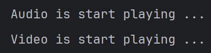

# Adapter Design Pattern

Yaitu desgin pattern untuk **mengubah sebuah class menjadi class lain**

## Contoh
Ada class **HandlePalyer** untuk mengubah class baik menjadi **AudioPlayer** atau **VideoPlayer**

## Output Sample
