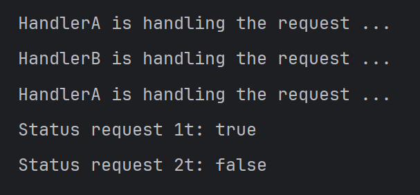

# Chain of Responsibility

Yaitu design pattern untuk **menghandle request yang dikirimkan dari pengirim ke penerima**. Artinya, request tersebut akan di cek terus seperti rantai.

## Contoh
Ada class **Request** dan **Handler**. Clas **Handler** memiliki beberapa child class seperti **HandlerA** dan **HandlerB** yang merepresentasikan jenis - jenis lain Handler yang akan mengecek request yang masuk. Jika request **tidak valid** di salah satu handler, maka status **isHandled** pada request akan bernilai false.

## Output Sample
