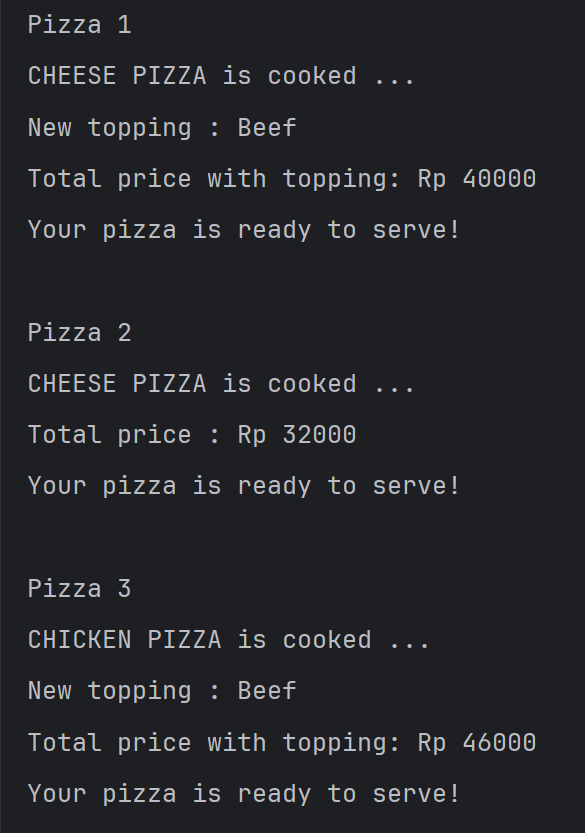
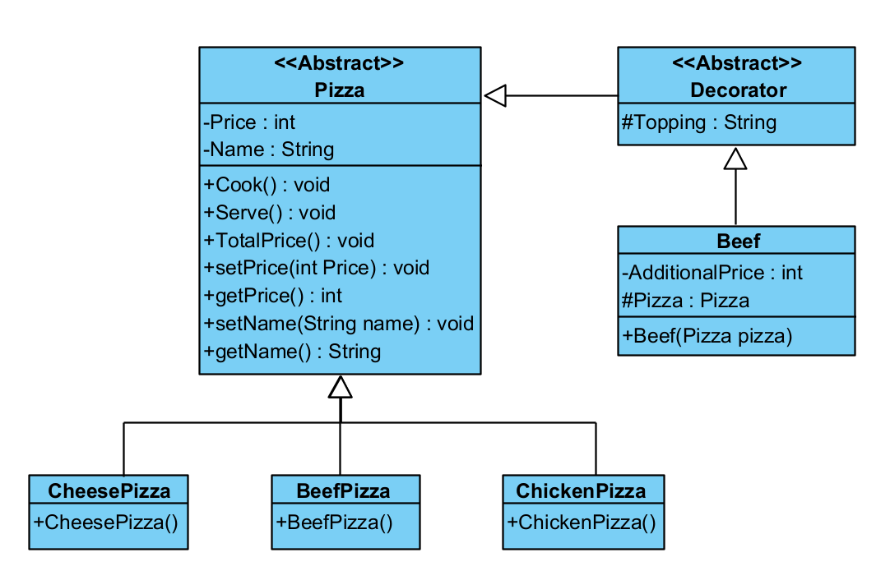

# Decorator Design Pattern

Decorator digunakan kalau kita ingin **menambahkan fungsi atau fitur baru** pada sebuah class. Intinya kita tidak perlu memodifikasi class utama. Namun cukup membuat class khusus **"Decorator"** untuk menambahkan fungsi atau fitur yang akan tersemabung dengan class Decorator tersebut.

## Contoh
Ada class **Pizza** dengan beberapa jenis class Pizza lain, seperti CheesePizza, BeefPizza, dan ChickenPizza. Jika user ingin menambah topping dari Pizza itu sendiri, maka kita bisa buat class **Decorator** yang khusus ngehandle topping tersebut. Lalu, buat class sesuai dengan topping yang inign ditambahkan, seperti **Beef** yang akan menjadi chil class dari class **Decorator**

## Output Sample

## Class Diagram
