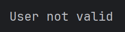
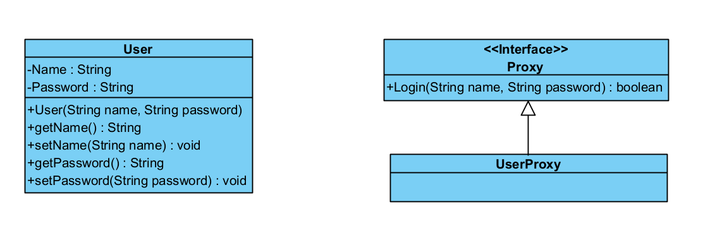

# Proxy

Protection Proxy yaitu design pattern yang digunakan untuk **memvalidasi sebuah aksi** yang dilakukan user.

## Contoh
Ada class **User** yang bisa melakukan fungsi **login** dari class **UserProxy**. Jadi semua validasi atau aksi akan dicek oleh **UserProxy**.

## Output Sample

## Class Diagram
