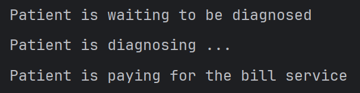

# State Design Pattern

Yaitu design pattern yang digunakan untuk **mengubah perilaku objek seusai dengan kondisinya**.

## Contoh
Ada class **Patient** yang akan berubah - ubah perilakunya sesuai dengan kondisinya, yaitu WaitingState, DiagnoseState, dan PaymentState.

## Output Sample
