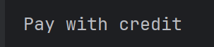

# Strategy Design Pattern

Yaitu design pattern yang digunakan untuk **mengubah perilaku objek** sesuai dengan fungsi / fituru yang ingin diterapkan.

## Conntoh
Ada interface **Payment** yang mempunya function **Pay**. Setiap class yang mengimplements interface tersebut akan mempunya **behaviour** dari function **Pay** yang berbeda - beda.

## Output
