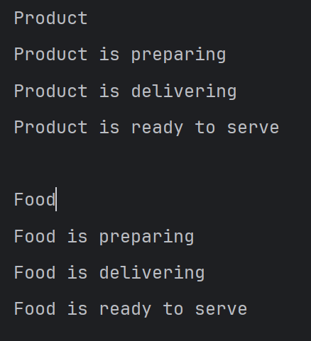
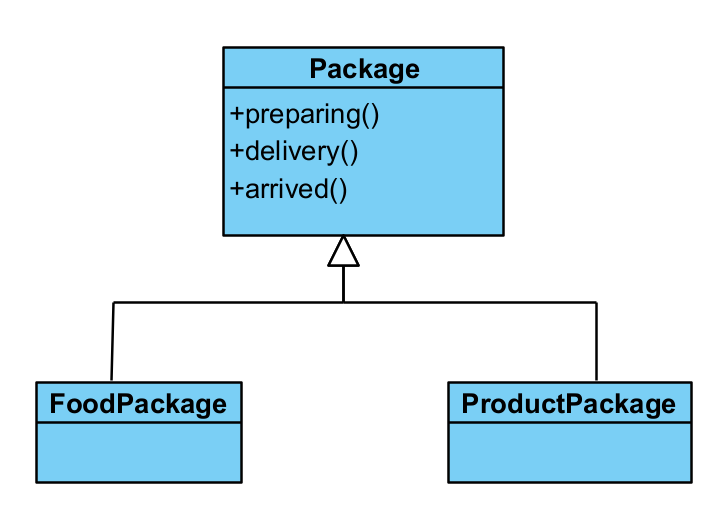

# Template Design Pattern

Yaitu design pattern yang digunakan sebagai **kerangka kerja / template** yang bisa digunakan untuk mengimplementasikan function = function tertentu terhadap class turunannya.

## Contoh
Ada class **Product** yang memiliki bebreapa fungsi yang siap untuk digunakan untuk class lain yang menjadi child class nya.

## Output Sample

## Class Diagram
